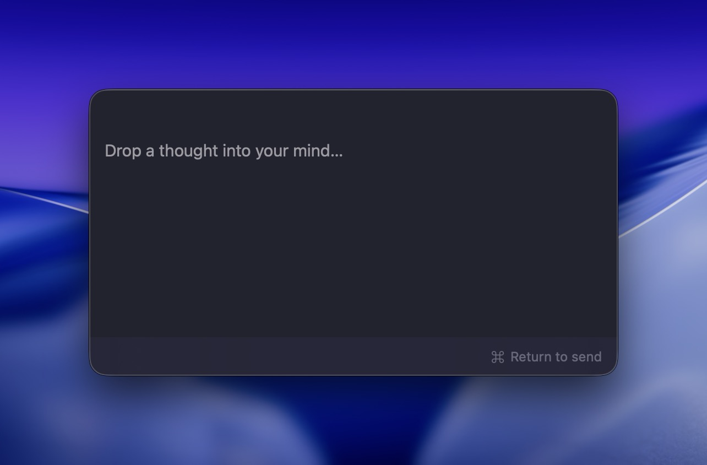

# CapMind

> Working title — likely rebranded before the first public release. The name lives behind constants in `Sources/CapMind/AppConstants.swift`, so a global rename is a find-and-replace.

A macOS menu-bar app that sends content to [MyMind](https://mymind.com) with zero friction — no browser, no organizing step. Three ways in:

- **Text note** — a global hotkey opens a small floating editor; type, `⌘↩`, done.
- **Region screenshot** — a global hotkey gives you a crosshair; drag a region and it uploads as a native-resolution PNG.
- **Drag-and-drop** — drop files, a URL, selected text, or an image onto the menu-bar icon.

CapMind is write-only: it never lists, searches, or shows your existing MyMind objects. It's the sibling of [CapNote](https://github.com/lardissone/cap-note) (same idea, for Capacities) and reuses its architecture, UI patterns, and build pipeline.

<p align="center">
  
</p>

## Requirements

- macOS 15.0 (Sequoia) or later.
- A paid MyMind account and an **access key** (Key ID + secret) from [access.mymind.com/extensions](https://access.mymind.com/extensions).

## Install

Download the latest build from [Releases](https://github.com/lardissone/cap-mind/releases), unzip, and drag `CapMind.app` to `/Applications`. It updates itself automatically.

On first launch there's no window and no Dock icon — look for the tray icon in the menu bar (it starts red, meaning "not configured yet").

## Setup

1. Click the menu-bar icon → **Open Settings…**
2. In **Account**, click **Generate access key** to open MyMind, create a key, and copy the **Key ID** and **secret** (the secret is shown only once).
3. Paste both into CapMind and click **Test connection**. Green "Connected" means you're set — the icon turns normal and the actions enable. The secret is stored in your macOS Keychain; the Key ID lives in `UserDefaults`.

## Usage

| Action | Default shortcut | Notes |
| --- | --- | --- |
| New note | `⌘⇧⌥M` | Floating editor. `⌘↩` send · `Esc` discard. |
| Capture region | `⌘⇧⌥S` | Drag a rectangle; `Esc` cancels. Uploads PNG at native resolution. |
| Drag-and-drop | — | Drop onto the menu-bar icon. Multiple items upload serially with a progress toast. |

Both shortcuts are configurable in **Settings → Shortcuts**.

> **Shortcut conflicts:** the `⌘⇧⌥M`/`⌘⇧⌥S` defaults can clash with launchers/capture tools (Raycast, Alfred, CleanShot's `⌘⇧⌥`-space family). If a hotkey doesn't fire, rebind it in Settings.

> **Screen Recording permission:** the first region capture triggers macOS's Screen Recording prompt. If you decline, CapMind shows an alert linking straight to **System Settings → Privacy & Security → Screen Recording** — enable CapMind there and try again.

Supported drop formats (per [MyMind](https://access.mymind.com/api/supported-formats), 64 MB cap): jpg, jpeg, png, gif, webp, avif, heif/heic, jxl, bmp, tiff, psd, svg, txt, md, pdf. A dragged web link is sent as a URL; selected text is sent as Markdown; oversized or unsupported files are rejected before any upload with a clear toast.

## Build from source

```bash
git clone https://github.com/lardissone/cap-mind
cd cap-mind
xed .            # opens the SwiftPM package in Xcode
# or, from the CLI:
swift build
swift test
```

### Assemble a runnable `.app`

`bin/make-app.sh` builds the binary, wraps it in a proper `.app` bundle, embeds `Sparkle.framework`, writes `Info.plist`, and code-signs. With no signing identity it signs **ad-hoc** (`-`), which is enough to run locally and on your own machines.

```bash
swift build -c release      # required once so Sparkle.framework is fetched into .build/artifacts
bin/make-app.sh             # → dist/CapMind.app (host arch, ad-hoc signed)
# or a universal (arm64 + x86_64) bundle with an explicit version:
bin/make-app.sh 0.1.0 universal
```

Open it with `open dist/CapMind.app` (or move it to `/Applications`).

### Run it on another Mac

An **ad-hoc-signed** build (no Developer ID) is not notarized, so Gatekeeper on a *different* Mac will refuse it on first open. You have three options:

1. **Build on that Mac** (recommended for personal use): clone the repo there, `swift build -c release && bin/make-app.sh`, then `open dist/CapMind.app`. Local ad-hoc builds run without Gatekeeper friction.
2. **Copy the ad-hoc `.app` and clear quarantine on the target Mac:**
   ```bash
   xattr -dr com.apple.quarantine /Applications/CapMind.app
   open /Applications/CapMind.app
   ```
   (Or right-click the app → **Open** → **Open** the first time.)
3. **Distribute properly** with a Developer ID build via the release workflow (see below) — required if other people install it.

First launch: no Dock icon, look for the menu-bar tray icon (red until you add your access key in Settings). The first region capture will prompt for **Screen Recording** permission.

### Sparkle update-signing key

Auto-updates are verified with an EdDSA key pair. You generate it **once**; the private key stays on your machine (and in a CI secret), the public key ships inside the app. The tools come with the Sparkle dependency after a build:

```bash
swift build                                          # ensures the tools exist
.build/artifacts/sparkle/Sparkle/bin/generate_keys   # prints the PUBLIC key; stores the PRIVATE key in your login Keychain
```

- Paste the printed **public** key into `SU_PUBLIC_ED_KEY` in `bin/make-app.sh` and commit it. It's safe to be public.
- For CI, export the **private** key and store it as the `SPARKLE_ED_PRIVATE_KEY` GitHub secret:
  ```bash
  .build/artifacts/sparkle/Sparkle/bin/generate_keys -x sparkle_private_key.pem   # writes the private key to a file
  # paste the file contents into the SPARKLE_ED_PRIVATE_KEY repo secret, then delete it:
  rm sparkle_private_key.pem
  ```
- Never commit the private key. If you only build/run locally and don't use auto-update, you can leave the placeholder — the app runs fine; only "Check for Updates" needs a real key + a published appcast.

### Releases (signed, notarized, auto-update)

Pushing a `v*` tag runs `.github/workflows/release.yml`: build → Developer-ID sign (hardened runtime) → notarize → staple → GitHub Release → Sparkle appcast on `gh-pages`.

```bash
git tag v0.1.0 && git push origin v0.1.0
```

Before the first release, set these GitHub repo **secrets** (Settings → Secrets and variables → Actions):

| Secret | What it is |
| --- | --- |
| `MACOS_CERTIFICATE_P12_BASE64` | Your "Developer ID Application" cert + key exported as `.p12`, then `base64`-encoded. |
| `MACOS_CERTIFICATE_P12_PASSWORD` | Password you set when exporting the `.p12`. |
| `APPLE_ID` | Apple ID email used for notarization. |
| `APPLE_ID_PASSWORD` | An app-specific password (appleid.apple.com), not your real password. |
| `APPLE_TEAM_ID` | Your Apple Developer Team ID. |
| `SPARKLE_ED_PRIVATE_KEY` | The Sparkle private key from the step above. |

And make sure `SU_PUBLIC_ED_KEY` in `bin/make-app.sh` holds your real Sparkle public key, and `SUFeedURL` points at your `gh-pages` appcast (enable GitHub Pages for the `gh-pages` branch). A Developer ID requires a paid Apple Developer Program membership.

## Architecture

A custom `NSStatusItem` (menu + drag destination) drives three `@MainActor` coordinators — `NotePanelController`, `RegionCaptureController`, `DropController` — that all call one stateless `MyMindClient` (URLSession + HS256 JWT signer + hand-built multipart + single-retry rate-limit backoff). No local database; settings in `UserDefaults`, the API secret in Keychain.

Dependencies: [KeyboardShortcuts](https://github.com/sindresorhus/KeyboardShortcuts) (global hotkeys) and [Sparkle](https://github.com/sparkle-project/Sparkle) (updates). JWT signing uses CryptoKit; no other third-party libraries.

## Support

If CapMind is useful to you, you can support its development:

[](https://ko-fi.com/L2Z120QWZL)

## License

MIT — see [LICENSE](./LICENSE).
